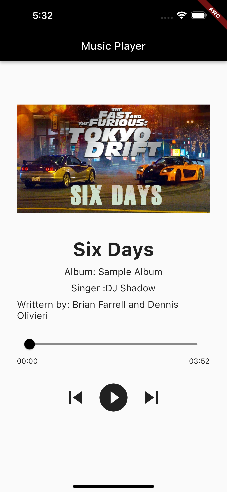

# Flutter Music Player 🎶

Welcome to my Flutter Music Player project! This app showcases a custom music player built with Flutter and the `just_audio` package, featuring smooth playback with local audio and a real-time seek bar adjustment.

## Features

- Play local audio files
- Real-time seek bar for playback control
- Display song information including title, album, singer, and composer
- Simple and intuitive UI

## Screenshots



## Getting Started

To get a local copy up and running follow these simple steps.

### Prerequisites

- Flutter SDK: [Install Flutter](https://flutter.dev/docs/get-started/install)

### Installation

1. Clone the repo
   ```sh
   git clone https://github.com/AlfaWhoCodes/flutter-music-player.git
